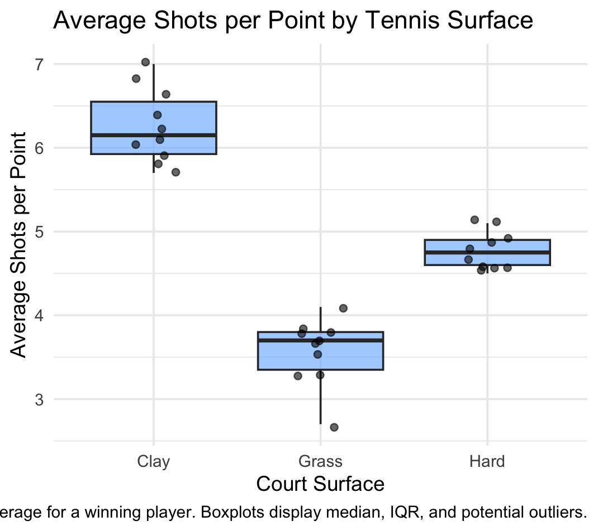

**Figure 1.** This plot shows the distribution of average shots per point across grass, hard, and clay tennis courts. Clay has the highest median and widest spread, indicating longer rallies. Grass has the lowest values, showing much shorter points. Hard courts fall in between.

For my analysis, I used Tukey’s Five-Number Summary to compare the distributions of average shots per point across the three court surfaces. This method gives the minimum, first quartile (Q1), median, third quartile (Q3), and maximum, which helps describe both the center and spread of the data. The results showed clear differences between surfaces. Clay courts had higher values for Q1, the median, and Q3 compared to grass and hard courts, meaning that at least half of the rallies on clay were longer than half of the rallies on the other surfaces. Grass had the lowest quartiles, showing that its rallies were generally much shorter. Hard courts were consistently in the middle for all five numbers. Overall, the five-number summaries indicate that clay produces the longest rallies, grass the shortest, and hard courts fall in between. This gives statistical evidence that court surface affects rally length and influences how long points tend to last. I chose this technique because my dataset compares rally lengths across different tennis court surfaces, and understanding the center and spread of each group is essential to interpreting how surfaces affect match play.
